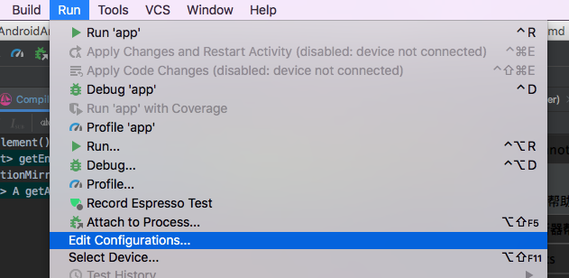
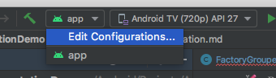
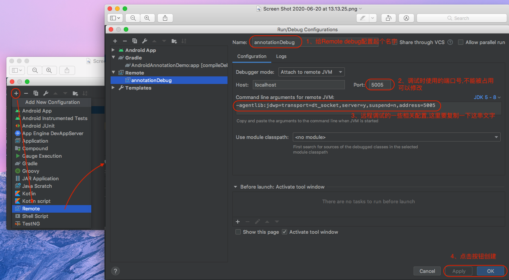
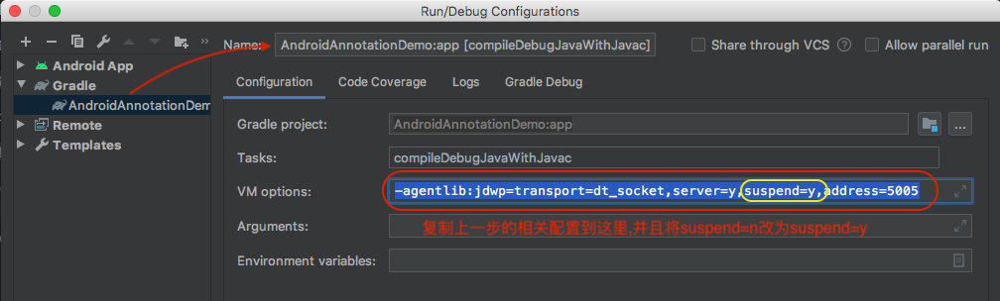
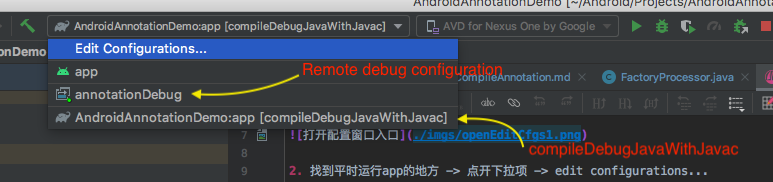
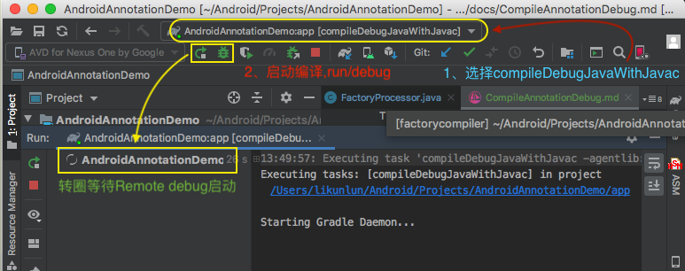
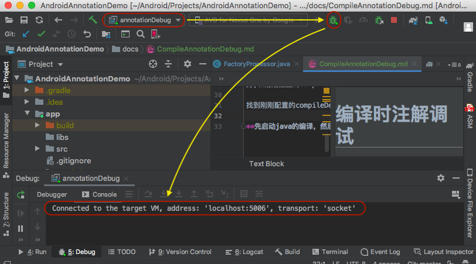

# 编译时注解调试

## 一、添加远程调试配置
### 1、打开配置窗口
1. android studio -> run -> edit configurations...



2. 找到平时运行app的地方 -> 点开下拉项 -> edit configurations...



### 2、建立一个Remote debug configuration



## 二、创建一个debug时的编译task

打开android studio右边的gradle窗口,找到主工程app -> tasks -> other -> compileDebugJavaWithJavac 右键点击create…



把刚刚复制的那串配置黏贴到WM options中，注意：**这里要把suspend改为y**意思是等待调试接入，点击OK

## 三、启动调试


找到平时运行app的地方,点开下拉项,这里可以见到至少3个可启动项,分别是app启动,刚刚新建的远程调试任
务,和刚刚配置的compileDebugJavaWithJavac任务。

找到刚刚配置的compileDebugJavaWithJavac任务,选中,然后点击运行,这个时候gradle会处于等待debug任务接入状态(就是一直打转)



这个时候可以开始启动远程调试任务了,annotationDebug点击debug,可以见到,控制台上输出了端口连接成功的字眼,再过几秒(gradle开始执行编译任务),就会进入到编译时注解的断点中,然后可以开始愉快的调试代码了



```
特别提醒:如果没有进入调试,但又出现了远程调试端口已连接
那么你需要删除app工程的build/generated/source/apt/debug/*中,编译出来的文件
```

**先启动java的编译，然后再启动remote调试**